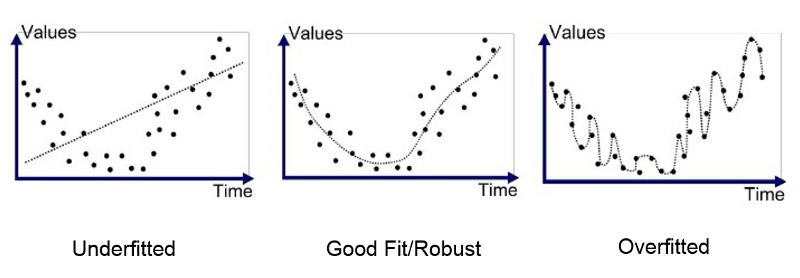

1. The Problem of overfitting 
    
    underfitting = high bias : 알고리즘이 편향이 생김 (낮은 차수 함수)
    
    overfitting  = high variance  : 가설은 데이터에 잘 맞으나, 커다란 변동성이 생김 (고차 함수)
    
    너무 많은 feature가 생길 때 training set에서는 cost function이 0에 가깝나 다른 데이터에 맞지 않음. (generalization이 안된다) 

    
    
    → feature의 수 줄이기(manually, model selection)
    
    → regularization
    

2. regularization 
    
    smaller value for parameters theta
    
    → simpler hypothesis 유도 (높은 차수의 theta를 penalty주는 방식으로)
    
    → overfitting 경향이 줄어듬
    
    $$ J(\theta) = \frac{1}{m} \sum_{i=1}^m \left[ -y^{(i)}\log \left( h_\theta \left(x^{(i)} \right) \right) - \left( 1 - y^{(i)} \right) \log \left( 1 - h_\theta \left( x^{(i)} \right) \right) \right] + \frac{\lambda}{2m} \sum_{j=1}^n \theta_j^2 $$
    
    왼쪽에 있는 시그마 식은 train data를 fit하게 하기 위함이고 오른쪽에 있는 식은 regularization으로 overfitting 피하기 위함이다.
    
    만약 regularization parameter가 너무 크다면 모든 parameter가 0이 되어 underfitting이 된다.
    
    참고로 $\theta0$는 상수항이므로 regularization 하지 않는다.

    
3. regularized linear regression
    
    $$ \frac{\partial J(\theta)}{\partial \theta_0} = \frac{1}{m} \sum_{i=1}^m \left( h_\theta \left(x^{(i)}\right) - y^{(i)} \right) x_j^{(i)} \qquad \text{for } j =0 $$

    $$ \frac{\partial J(\theta)}{\partial \theta_j} = \left( \frac{1}{m} \sum_{i=1}^m \left( h_\theta \left(x^{(i)}\right) - y^{(i)} \right) x_j^{(i)} \right) + \frac{\lambda}{m}\theta_j \qquad \text{for } j \ge 1 $$
    

4. logisitic regression
    
    hypothesis만 변경되고 동일